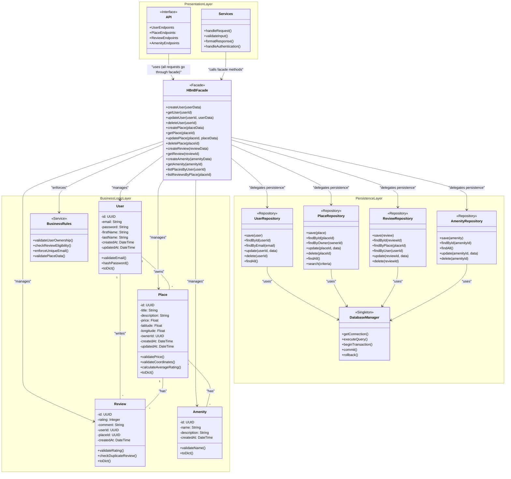

# HBnB Application - High-Level Package Diagram

## Package Diagram (Mermaid.js)



---

## 📋 Layer Descriptions

### 1. **Presentation Layer (Services/API)**

**Purpose**: 
- Handles all external communication with clients (web browsers, mobile apps, third-party services)
- First point of contact for all user requests

**Components**:

| Component | Responsibility | Examples |
|-----------|---------------|----------|
| **API** | Defines REST endpoints | `GET /api/users`, `POST /api/places`, `PUT /api/reviews/{id}` |
| **Services** | Request handling logic | Input validation, response formatting, authentication |

**Key Responsibilities**:
- ✅ Receive HTTP requests
- ✅ Validate request format (JSON structure, required fields)
- ✅ Authenticate and authorize users
- ✅ Call appropriate Facade methods
- ✅ Format responses (serialize to JSON)
- ✅ Handle errors and return appropriate HTTP status codes

**Example Flow**:
```
Client Request:
POST /api/places
{
  "title": "Cozy Apartment",
  "price": 100,
  "owner_id": "user-123"
}

↓

Services Layer:
- Validates JSON structure
- Checks authentication token
- Calls: facade.create_place(place_data)

↓

Returns:
HTTP 201 Created
{
  "id": "place-456",
  "title": "Cozy Apartment",
  "price": 100
}
```

---

### 2. **Facade Pattern (HBnBFacade)**

**Purpose**: 
- Acts as the **single point of entry** between Presentation Layer and Business Logic Layer
- Simplifies complex subsystem interactions
- Provides a unified, simplified interface

**Why Use Facade Here?**
1. **Decoupling**: API doesn't need to know about internal models and repositories
2. **Simplification**: One interface instead of multiple classes
3. **Flexibility**: Can change internal implementation without affecting API
4. **Control**: Centralized point for cross-cutting concerns (logging, transactions)

**Key Methods**:

| Method | Purpose | Example |
|--------|---------|---------|
| `createUser(userData)` | Validates and creates new user | Checks email uniqueness, hashes password, saves to DB |
| `getUser(userId)` | Retrieves user by ID | Fetches from repository, returns user object |
| `createPlace(placeData)` | Validates and creates place | Checks owner exists, validates price, saves to DB |
| `listPlacesByUser(userId)` | Gets all places owned by user | Queries PlaceRepository, returns list |
| `createReview(reviewData)` | Creates review with validation | Checks duplicate, validates rating, updates place rating |

**Communication Flow**:
```
API Layer
    ↓
    ↓ (calls facade methods)
    ↓
HBnBFacade
    ↓
    ├→ Business Logic (validates, processes)
    ↓
    └→ Persistence Layer (saves/retrieves data)
```

**Example Implementation Concept**:
```python
class HBnBFacade:
    def __init__(self):
        self.user_repo = UserRepository()
        self.place_repo = PlaceRepository()
        
    def create_place(self, place_data):
        # 1. Business Logic validation
        if place_data['price'] <= 0:
            raise ValueError("Price must be positive")
            
        # 2. Check owner exists
        owner = self.user_repo.findById(place_data['owner_id'])
        if not owner:
            raise ValueError("Owner not found")
            
        # 3. Create Place model
        place = Place(**place_data)
        
        # 4. Persist via repository
        saved_place = self.place_repo.save(place)
        
        # 5. Return result
        return saved_place
```

---

### 3. **Business Logic Layer (Models)**

**Purpose**: 
- Contains the **core domain logic** of the application
- Defines entities and their behaviors
- Enforces business rules

**Components**:

#### **User Model**
```
Attributes:
- id: Unique identifier
- email: User's email (unique)
- password: Hashed password
- firstName, lastName: User's name
- createdAt, updatedAt: Timestamps

Methods:
- validateEmail(): Ensures email format is correct
- hashPassword(): Securely hashes password
- toDict(): Converts to dictionary for serialization

Business Rules:
- Email must be unique
- Password must be at least 8 characters
- Email format must be valid
```

#### **Place Model**
```
Attributes:
- id: Unique identifier
- title: Place name
- description: Detailed description
- price: Price per night
- latitude, longitude: Location coordinates
- ownerId: Reference to User who owns it

Methods:
- validatePrice(): Ensures price > 0
- validateCoordinates(): Checks valid lat/long
- calculateAverageRating(): Computes from reviews

Business Rules:
- Price must be positive
- Owner must exist
- Coordinates must be valid (-90 to 90 for lat, -180 to 180 for long)
```

#### **Review Model**
```
Attributes:
- id: Unique identifier
- rating: 1-5 stars
- comment: Review text
- userId: Who wrote the review
- placeId: Which place is reviewed

Methods:
- validateRating(): Ensures rating between 1-5
- checkDuplicateReview(): One review per user per place

Business Rules:
- User can only review a place once
- Rating must be 1-5
- User must exist
- Place must exist
```

#### **Amenity Model**
```
Attributes:
- id: Unique identifier
- name: Amenity name (e.g., "WiFi", "Pool")
- description: Details

Business Rules:
- Name must be unique
- Name is required
```

#### **BusinessRules Service**
```
Central location for cross-cutting business logic:
- validateUserOwnership(): Check if user owns a place
- checkReviewEligibility(): Can user review this place?
- enforceUniqueEmail(): Ensure no duplicate emails
```

**Relationships**:
- User **owns** many Places (1-to-many)
- User **writes** many Reviews (1-to-many)
- Place **has** many Reviews (1-to-many)
- Place **has** many Amenities (many-to-many)

---

### 4. **Persistence Layer (Database Access)**

**Purpose**: 
- Handles all database operations
- Abstracts database details from business logic
- Implements the **Repository Pattern**

**Components**:

#### **Repository Pattern**
Each entity has a corresponding repository that handles its database operations:

| Repository | Responsibilities |
|------------|------------------|
| **UserRepository** | CRUD operations for users, find by email |
| **PlaceRepository** | CRUD for places, search by criteria, find by owner |
| **ReviewRepository** | CRUD for reviews, find by place/user |
| **AmenityRepository** | CRUD for amenities |

#### **Common Repository Methods**:
```
save(entity)        → Insert new record
findById(id)        → Retrieve by primary key
findAll()           → Get all records
update(id, data)    → Update existing record
delete(id)          → Remove record
```

#### **DatabaseManager (Singleton)**
```
Purpose: Manages database connections and transactions

Methods:
- getConnection(): Returns DB connection
- executeQuery(sql, params): Runs SQL query
- beginTransaction(): Starts transaction
- commit(): Commits transaction
- rollback(): Reverts transaction on error
```

**Example Repository Implementation**:
```python
class PlaceRepository:
    def save(self, place):
        query = "INSERT INTO places (id, title, price, owner_id) VALUES (?, ?, ?, ?)"
        db.executeQuery(query, [place.id, place.title, place.price, place.ownerId])
        return place
        
    def findById(self, place_id):
        query = "SELECT * FROM places WHERE id = ?"
        result = db.executeQuery(query, [place_id])
        return Place.fromDict(result)
```

---

## 🔄 Communication Pathways Explained

### **Pathway 1: Presentation → Facade**
```
API/Services → HBnBFacade

Direction: One-way (API calls Facade)
Purpose: All presentation layer requests go through the facade
Example: API calls facade.createPlace(data)
```

### **Pathway 2: Facade → Business Logic**
```
HBnBFacade → Models (User, Place, Review, Amenity)
HBnBFacade → BusinessRules

Direction: Facade coordinates models
Purpose: Facade instantiates models, applies business rules
Example: Facade creates Place object, validates with BusinessRules
```

### **Pathway 3: Facade → Persistence**
```
HBnBFacade → Repositories → DatabaseManager

Direction: Facade delegates to repositories
Purpose: Facade uses repositories to persist/retrieve data
Example: Facade calls PlaceRepository.save(place)
```

### **Pathway 4: Business Logic ↔ Business Logic**
```
Models relate to each other

Relationships:
- User owns Places
- User writes Reviews
- Place has Reviews
- Place has Amenities

Purpose: Represents domain relationships
```

---

## 📊 Complete Request Flow Example

**Scenario**: User creates a review for a place

```
Step 1: PRESENTATION LAYER
POST /api/reviews
{
  "user_id": "user-123",
  "place_id": "place-456",
  "rating": 5,
  "comment": "Amazing place!"
}

↓

Step 2: API validates request format
- JSON is valid ✓
- Required fields present ✓

↓

Step 3: API calls FACADE
facade.createReview(review_data)

↓

Step 4: FACADE coordinates BUSINESS LOGIC
- Check if user exists (calls UserRepository)
- Check if place exists (calls PlaceRepository)
- Validate rating (1-5) ✓
- Check if user already reviewed this place (BusinessRules)
- Create Review object

↓

Step 5: FACADE coordinates PERSISTENCE
- ReviewRepository.save(review)
- Update place's average rating
- PlaceRepository.update(place_id, new_rating)

↓

Step 6: Return through FACADE
Facade returns created review

↓

Step 7: PRESENTATION LAYER formats response
HTTP 201 Created
{
  "id": "review-789",
  "rating": 5,
  "comment": "Amazing place!",
  "created_at": "2024-02-11T10:30:00Z"
}
```

---

## ✅ Key Benefits of This Architecture

| Benefit | Explanation |
|---------|-------------|
| **Separation of Concerns** | Each layer has one clear responsibility |
| **Maintainability** | Can modify one layer without affecting others |
| **Testability** | Each layer can be tested independently |
| **Scalability** | Can scale layers independently (e.g., multiple API servers, separate DB server) |
| **Reusability** | Business logic can be used by different presentation layers (REST API, GraphQL, CLI) |
| **Flexibility** | Can swap implementations (e.g., change database) without affecting other layers |
| **Clear Dependencies** | Dependencies flow in one direction (top to bottom) |
| **Reduced Coupling** | Facade reduces dependencies between layers |

---

## 🎯 Architecture Principles Applied

1. **Single Responsibility Principle**: Each class/layer has one clear purpose
2. **Dependency Inversion**: High-level modules (API) don't depend on low-level modules (Database)
3. **Open/Closed Principle**: Open for extension, closed for modification
4. **Interface Segregation**: Facade provides clean, focused interface
5. **DRY (Don't Repeat Yourself)**: Business logic centralized in one layer

---

## 📝 Notes for Implementation

1. **Facade is the gateway**: Never bypass the facade - all inter-layer communication goes through it
2. **Repositories abstract database**: Business logic never writes SQL directly
3. **Models are rich objects**: They contain behavior, not just data
4. **Validation happens in business logic**: Not in API, not in database
5. **Each layer is independently testable**: Mock the facade for API tests, mock repositories for business logic tests

---

## 🔍 What We've Created

This diagram shows:
- ✅ **Three clear layers** with distinct responsibilities
- ✅ **Facade pattern** as the communication interface
- ✅ **All key components**: User, Place, Review, Amenity, Repositories
- ✅ **Communication pathways**: Clear arrows showing data flow
- ✅ **Relationships**: How entities relate to each other
- ✅ **Professional structure**: Follows industry best practices

This architecture provides a solid foundation for building a scalable, maintainable HBnB application!
